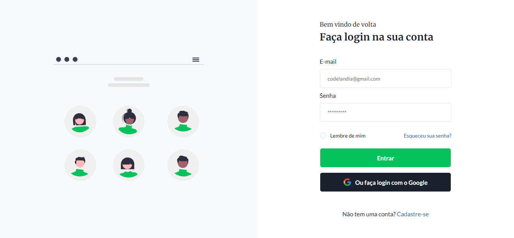

# Desafio 04 da comunidade Codelândia no Discord

## 💻 _login_

Repositório criado para armazenar o desafio 04 proposto por Iuri Silva criador da comunidade Codelândia no Discord.

## 💻  Projeto desenvolvido
<a href="https://gabrieldiasdev.github.io/login/" target="_blank">Acesse o projeto</a>

## 💡  Info

O projeto contém uma interface moderna e responsiva de login/register, com integração de uma BaaS (Backend as a Service) para salvar a conta do usuário que cadastrar-la podendo fazer login com a conta criada ou até mesmo fazer login com uma conta do google.

## 🔨 Possiveis atualizações

📍 Tela e sistema de recuperar senha perdida. 
📍 Implementar um alert animado e personalizado.

## 👨‍💻 Autor
 

Gabriel Dias Catarin, desenvolvedor front-end | Bauru, São Paulo

[ LinkedIn](https://www.linkedin.com/in/gabriel-dias-260857207/)
&nbsp;